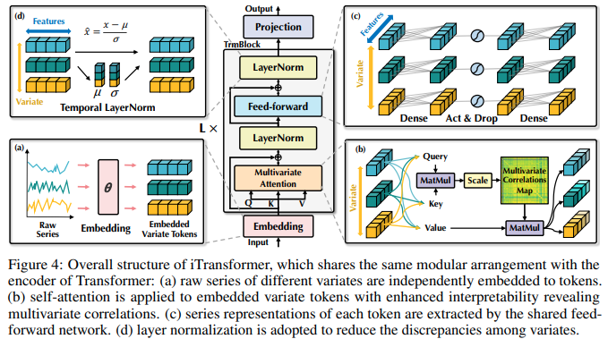

</img>

## iTransformer (wip)

Implementation of iTransformer - SOTA Time Series Forecasting using Attention networks, out of Tsinghua / Ant group

All that remains is tabular data (xgboost still champion here) before one can truly declare "Attention is all you need"

## Citation

```bibtex
@misc{liu2023itransformer,
  title   = {iTransformer: Inverted Transformers Are Effective for Time Series Forecasting}, 
  author  = {Yong Liu and Tengge Hu and Haoran Zhang and Haixu Wu and Shiyu Wang and Lintao Ma and Mingsheng Long},
  year    = {2023},
  eprint  = {2310.06625},
  archivePrefix = {arXiv},
  primaryClass = {cs.LG}
}
```
